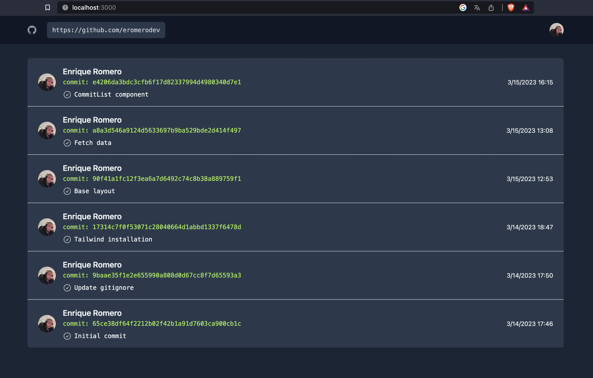

This is a [Next.js](https://nextjs.org/) project bootstrapped with [`create-next-app`](https://github.com/vercel/next.js/tree/canary/packages/create-next-app).

## Getting Started

First, run the development server:

```bash
# download or clone the project
git clone git@github.com:eromerodev/commit-history-app.git

# go to the project root
cd commit-history-app

# install dependencies
npm i

# start development server
npm run dev
```

Open [http://localhost:3000](http://localhost:3000) with your browser to see the result.



## Backend

The backend api (BFF) for this project is in the following repository:

https://github.com/eromerodev/commit-history-bff

